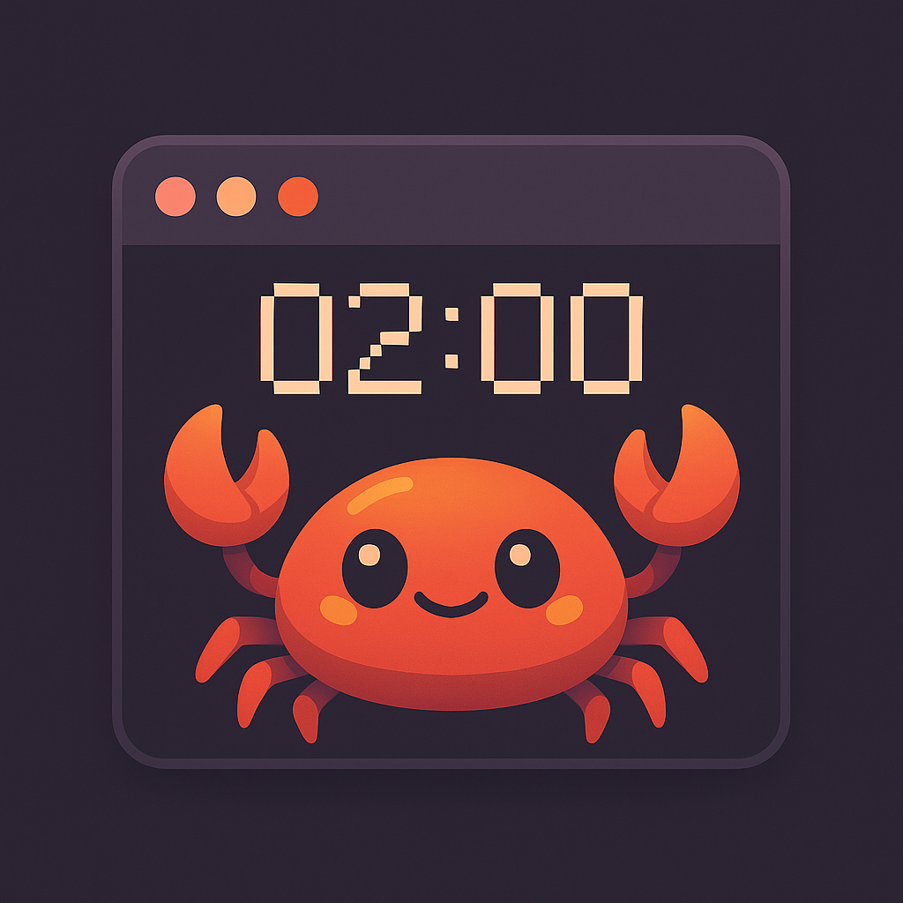
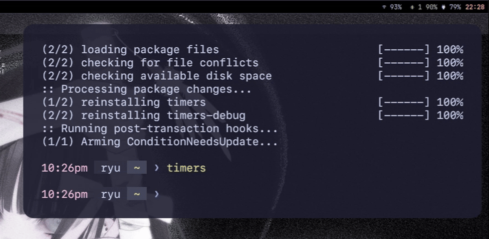

<p align="center">
  <table>
    <tr>
      <td>
        
      </td>
      <td>
        <h1 style="display: inline; vertical-align: middle; margin-left: 16px;">
          Time-RS CLI 
        </h1>
      </td>
    </tr>
  </table>
</p>


<h6 align="center" style="color:#bac2de;">
  A minimal Catppuccin-themed TUI countdown timer.
</h6>

<p align="center">
  <!-- GitHub Stars -->
  <a href="https://github.com/ryu-ryuk/yoru-timer-cli/stargazers">
    
  </a>
  <!-- GitHub Issues -->
  <a href="https://github.com/ryu-ryuk/yoru-timer-cli/issues">
    
  </a>
  <!-- License -->
  <a href="https://github.com/ryu-ryuk/yoru-timer-cli/blob/main/LICENSE">
    
  </a>
</p>


<p align="center">
  <!-- Rust Edition -->
  
  <!-- Ratatui -->
  
  <!-- Theme -->
  
  <!-- Platform -->
  
</p>


<p align="center" style="color:#a6adc8; font-size: 14.5px; line-height: 1.6; max-width: 700px; margin: auto;">
  <strong style="color:#cdd6f4;">Time-RS CLI</strong> is a highly minimal, distraction-free terminal countdown timer.<br/>
  Built in <span style="color:#89b4fa;">Rust</span> using <span style="color:#b4befe;">ratatui</span> and themed with <span style="color:#f5c2e7;">Catppuccin Mocha</span>.<br/>
  Perfect for Pomodoros, build pauses, CLI workflows, or just flexing nerdy timers in your terminal.
</p>

---

## 🎥 Preview

<p align="center">
  
</p>

---

## ⏳ Features

* ⌨️ TUI controls:
  - `r` — restart timer
  - `j/k` — add/subtract 10s
  - `h` — show/hide help
  - `esc` — close help
  - `q` — quit
  - `p` - pomodoro timer

* 🎨 Catppuccin Mocha theming (colors, borders, text)
* 🧠 Smart redraws and minimalist centered layout
* 🧱 Built using [`ratatui`](https://github.com/ratatui-org/ratatui) + `crossterm`
* 📦 Single binary, zero dependencies at runtime


## 🧪 Try Kitty Popup Mode

You can use a floating terminal like `kitty` to simulate a popup view: | Might not work :(

```sh
kitty --override initial_window_width=50c \
      --override initial_window_height=8c \
      ./yoru-timer-cli
```

## ⚙ Build 
```sh
git clone https://github.com/ryu-ryuk/yoru-timer-cli
cd yoru-timer-cli
cargo build --release
./target/release/yoru-timer-cli
```

## 🌫 Contributing

I welcome contributions! Whether it's bug fixes, new features, or improvements, feel free to open issues or submit pull requests.

### Development Setup
 
* Fork the repository.

* Clone your fork.

* Create a new branch for your feature or bugfix.

* Make your changes and commit with clear messages.

* Push your branch and open a pull request.

#### Thank you for helping make Time-RS CLI better! 💜